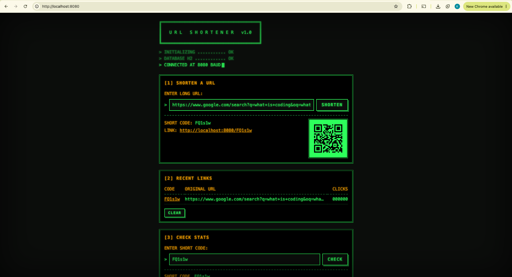

# URL Shortener

A Spring Boot REST API that turns long URLs into short codes, redirects visitors, and tracks clicks, with a retro terminal-style frontend.

## Screenshot



## What this project demonstrates

- **Layered architecture with DTOs.** Controllers, a service, and a repository each have one job, and Java records keep the JPA entity out of API responses.
- **Short-code collision handling.** Random 6-character Base62 codes are checked before saving and regenerated up to 5 times, with a unique index on `short_code` as a database-level backstop.
- **Atomic click counting.** A single `@Modifying @Query` update (`click_count = click_count + 1`) prevents lost updates when redirects happen at the same time. A read-modify-write approach would drop clicks under concurrency.
- **Consistent error responses.** One `@RestControllerAdvice` maps exceptions to a standard `ApiError` JSON body: 400 for validation, 404 for unknown codes, 503 when code generation is exhausted.
- **Request validation.** `@Valid` with `@NotBlank`, `@Size`, and `@URL` rejects bad input before it reaches the service and returns field-level error messages.
- **Focused, fast tests.** Mockito unit tests cover the service logic, including the retry path, and `@WebMvcTest` slice tests check HTTP status codes and JSON shapes without starting the full application.
- **A frontend with no dependencies.** Plain HTML, CSS, and JavaScript served by Spring Boot, including a QR code encoder written from the QR specification instead of pulled from a library.

## Tech stack

| Layer | Technology |
|---|---|
| Language / build | Java 17, Maven (wrapper included) |
| Framework | Spring Boot 3.5 (Spring Web, Spring Data JPA, Bean Validation) |
| Database | H2 in-memory, with the H2 web console for inspection |
| Testing | JUnit 5, Mockito, Spring MockMvc |
| Containers | Docker (multi-stage build, non-root runtime user) |
| Frontend | HTML, CSS, vanilla JavaScript |

## Architecture

Requests flow through three layers. Controllers handle HTTP concerns and validation, the service holds the business rules (code generation, retries, click tracking), and the repository talks to H2 through Spring Data JPA. The frontend is a set of static files served by the same Spring Boot app, so it calls the REST API from the same origin with no CORS setup.

```text
  Browser (static index.html + app.js)
            |  fetch() JSON
            v
  +-----------------------------------------+
  | UrlController       RedirectController  |   <- @Valid, HTTP status codes
  +-----------------------------------------+
            |                                    GlobalExceptionHandler -> ApiError
            v
  +-----------------------------------------+
  | UrlShortenerService                     |   <- code generation, retry, @Transactional
  +-----------------------------------------+
            |
            v
  +-----------------------------------------+
  | UrlMappingRepository (Spring Data JPA)  |   <- derived queries + atomic @Modifying update
  +-----------------------------------------+
            |
            v
       H2 in-memory database (url_mappings)
```

## API reference

| Method | Path | Request body | Response | Status codes |
|---|---|---|---|---|
| `POST` | `/api/shorten` | `{ "longUrl": "https://..." }` | `{ "shortCode", "shortUrl" }` plus a `Location` header | `201` created, `400` invalid URL or malformed JSON, `503` no unique code after 5 attempts |
| `GET` | `/{shortCode}` | none | Redirect to the original URL; increments the click count | `302` found, `404` unknown code |
| `GET` | `/api/stats/{shortCode}` | none | `{ "shortCode", "longUrl", "clickCount", "createdAt" }` | `200` OK, `404` unknown code |

Every error uses the same shape:

```json
{
  "timestamp": "2026-09-23T20:18:39Z",
  "status": 400,
  "error": "Bad Request",
  "message": "Validation failed",
  "path": "/api/shorten",
  "fieldErrors": [{ "field": "longUrl", "message": "longUrl must be a valid http or https URL" }]
}
```

## Running locally

**Option 1: Maven** (requires Java 17+)

```bash
git clone https://github.com/zeke75895/url-shortener.git
cd url-shortener
./mvnw spring-boot:run        # or: mvn spring-boot:run
```

**Option 2: Docker**

```bash
docker build -t url-shortener .
docker run --rm -p 127.0.0.1:8080:8080 url-shortener
```

Then open **http://localhost:8080**. You can also use the API directly:

```bash
curl -X POST http://localhost:8080/api/shorten \
  -H "Content-Type: application/json" \
  -d '{"longUrl":"https://spring.io/projects/spring-boot"}'
```

To inspect the database, open http://localhost:8080/h2-console and log in with JDBC URL `jdbc:h2:mem:urlshortener`, user `sa`, and an empty password. Data is in memory, so it resets when the app restarts.

## Running the tests

```bash
./mvnw test
```

The 17 tests cover the service layer (code format, collision retry, retry exhaustion, click counting, not-found cases) and all three endpoints (status codes, redirect headers, validation errors, and the `ApiError` body).

## Project structure

```text
src/
├── main/java/com/example/url_shortener/
│   ├── controller/   UrlController (shorten, stats), RedirectController (302 redirect)
│   ├── service/      UrlShortenerService: code generation, retry, lookups
│   ├── repository/   UrlMappingRepository: derived queries + atomic click update
│   ├── model/        UrlMapping JPA entity (unique index on short_code)
│   ├── dto/          ShortenRequest, ShortenResponse, StatsResponse, ApiError (records)
│   └── exception/    GlobalExceptionHandler and custom exceptions
├── main/resources/
│   ├── application.properties          H2 and H2 console settings
│   ├── application-docker.properties   Container-only settings
│   └── static/                         index.html, style.css, app.js, qrcode.js
└── test/java/com/example/url_shortener/
    ├── service/      Mockito unit tests
    └── controller/   @WebMvcTest slice tests
```

## What I'd add next

- **Persistent storage.** Swap H2 for PostgreSQL with Flyway migrations so links survive restarts, and add Testcontainers integration tests against the real database.
- **Closing the collision race fully.** The exists-check can race with a concurrent insert. The unique index already prevents duplicates, but catching the constraint violation and retrying in a new transaction would turn that rare failure into a successful retry.
- **Custom aliases and duplicate detection.** Let users choose a code like `/spring-docs`, and return the existing code when the same long URL is submitted twice.
- **Rate limiting.** Limit shorten requests per client (for example, with Bucket4j) to protect the database from abuse.
